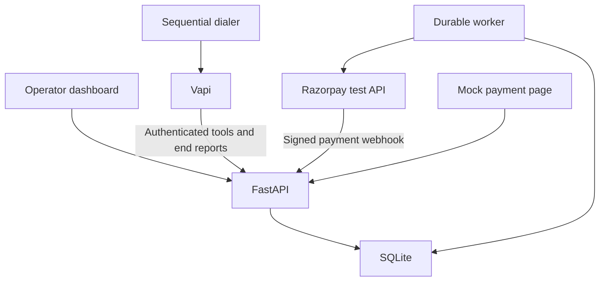

# Autopay Recovery Voice Agent

A complete local recovery demo built for Daniyah Rehman: FastAPI + SQLite, a responsive operations dashboard, a manual call simulator, nine guarded tools, a sequential outbound dialer, Vapi integration and optional Razorpay **test-mode** payment links.

**Fictional scenario only. Not affiliated with Razorpay. No real card charges.** All ten customers are synthetic. The default simulator needs no external API keys, makes no telephone calls and logs payment links instead of sending SMS.

## Start here on Windows

Run in Anaconda Prompt or PowerShell, from the repository directory:

```powershell
python -m venv .venv
.venv\Scripts\activate
python -m pip install -r requirements.lock
python scripts/setup_local.py
python -m pytest -q
python -m uvicorn app.main:app --host 127.0.0.1 --port 8000 --workers 1 --no-access-log
```

Open http://127.0.0.1:8000/dashboard. Open `.env` locally and copy `ADMIN_TOKEN` into the access form. Do not share or commit it. If PowerShell blocks activation, use `.venv\Scripts\python.exe` directly instead of changing system execution policy. Python 3.11 is the Docker/CI target; local verification used Python 3.12.

macOS/Linux activation: `source .venv/bin/activate`. Other commands are identical. Docker is optional.

## What works without credentials

- A dashboard with all ten customers, outcome filters, search, five-second refresh, calls, recovered value, recovery rate, promised payments, human follow-up, opt-outs and no-contact counts.
- Start/resume/end a simulated call, verify identity, attempt one mock retry, generate/pay a mock link, schedule a durable mock retry, request callback, create an escalation ticket and record DNC.
- Audit trail and payment outbox. Simulated calls have no audio or recording; the UI does not fabricate either.
- A database-backed worker executes due **mock** retries and creates optional test payment links. A restart resumes pending jobs. An ambiguous external request is sent to review instead of blindly retried.
- Tests for authorization, call isolation, lockout, consent, race conditions, token expiry, signatures, DNC, date boundaries and provider envelopes.

## Architecture



The UI is served by FastAPI, so there is no second frontend server, npm build or CORS setup. Plain JavaScript keeps deployment small while supporting a full workflow. SQLite transactions serialize verification, retries, outcomes and payment confirmation. A unique index permits only one active/placing/uncertain call at a time. Run **one service instance and one uvicorn worker**.

## Project map

| Path | Responsibility |
|---|---|
| `app/main.py` | Routes, authentication dependencies, response headers, worker lifecycle |
| `app/db.py` | Schema, seed-on-empty startup, transactions and audit events |
| `app/models.py` | Validated inputs and outcome enumeration |
| `app/tools.py` | Nine tool handlers, per-call verification, consent and idempotency |
| `app/calls.py` | Calling eligibility, global call lock, conservative provider failures |
| `app/provider.py` | All Vapi transport and envelope normalization |
| `app/payments.py` | Mock completion, signed Razorpay webhook, durable jobs |
| `app/static/` | Dashboard, styles, simulator and mock payment UI |
| `dialer/dialer.py` | Dry-run or approved sequential outbound calls |
| `provider/` | System prompt, generated tool schemas and provider exporter inputs |
| `data/customers.csv` | Original ten fictional records; invalid phone placeholders are intentionally non-dialable |
| `scripts/` | Setup, phone assignment, provider export and call reconciliation |
| `tests/` | Automated backend and integration-contract tests |
| `docs/` | Prompt review, demo run sheet, verification record and full guide |

## Secrets and configuration

| Variable | Purpose |
|---|---|
| `ADMIN_TOKEN` | Dashboard/operator bearer token; at least 24 characters |
| `WEBHOOK_SECRET` | Separate provider secret; at least 24 characters |
| `PUBLIC_BASE_URL` | Reachable origin; HTTPS for provider calls |
| `DATABASE_PATH` | Default `var/recovery.db`; persistent disk path when hosted |
| `PROVIDER` | `mock` by default, or `vapi` |
| `PROVIDER_API_KEY` | Private Vapi API key |
| `PROVIDER_AGENT_ID` | Saved Vapi assistant ID |
| `PROVIDER_PHONE_NUMBER_ID` | Vapi outbound phone resource ID |
| `ALLOWED_TEST_NUMBERS` | Comma-separated E.164 numbers you own or have written permission to call |
| `VAPI_CREDENTIAL_ID` | Saved Vapi webhook credential ID, using header `X-Webhook-Secret` with no prefix |
| `VAPI_MODEL` | Model to configure; default `gpt-4o-mini` |
| `VAPI_VOICE_PROVIDER`, `VAPI_VOICE_ID` | Configure a voice supported by your Vapi account; review English/Hindi capability |
| `RAZORPAY_KEY_ID` | Optional test key; a live-key prefix is rejected at startup |
| `RAZORPAY_KEY_SECRET` | Optional test API secret |
| `RAZORPAY_WEBHOOK_SECRET` | Required with test payment integration for HMAC verification |

`setup_local.py` generates random local secrets and never overwrites an existing `.env`. `.env`, databases, recordings and provider-generated configurations are excluded from git. The browser retains its operator token only in memory; reloading the tab requires unlocking it again.

## Tool protocol

All nine direct routes are POST JSON under `/tools/<name>`. Required headers:

```text
X-Webhook-Secret: your server secret
X-Call-Id: the internal CALL-... ID
Idempotency-Key: one unique ID per logical request
```

Use the **same** idempotency key if retrying a network request. Reusing it with different arguments returns 409. For Vapi, the adapter derives call identity and idempotency from the authenticated provider envelope, not from conversation text. Customer ID must match the customer assigned to that provider call.

| Tool | Additional input | Conditions |
|---|---|---|
| `verify_identity` | `answer` | At most two attempts per call; whitespace/case normalization |
| `get_payment_details` | None | Verified active call |
| `retry_payment` | `consent: true` | Verified, eligible instrument, at most once per call |
| `send_payment_link` | `consent: true`, optional `channel: "sms"` | Verified; channel logged only |
| `schedule_retry` | `consent: true`, `date: "YYYY-MM-DD"` | Tomorrow through seven days ahead, India timezone |
| `request_callback` | `time_window` | No verification needed; records window only |
| `escalate_to_human` | `reason` | No verification needed; records ticket only |
| `mark_dnc` | None | Permanent; available before verification |
| `log_outcome` | `outcome`, optional `notes` | Validated enum; cannot manufacture recovery |

Every body includes `customer_id`. Successful requests and rejections associated with an existing call are audited. Raw verification answers are excluded from events; idempotency uses keyed HMAC fingerprints. DNC blocks all later account actions except final outcome logging. A real, valid opted-out phone suppresses all records sharing that number. The invalid CSV phone placeholder is not considered a shared real number.

Other routes: `GET /health`, `GET /dashboard`, authenticated `GET /api/dashboard`, `GET /api/dialer/preview`, simulator routes, `POST /webhooks/vapi`, `POST /webhooks/call_ended`, signed `POST /webhooks/razorpay`, and tokenized `GET/POST /pay/<token>`. The dashboard HTML shell is public but contains no customer data. API data requires the operator token. GET on a payment URL never changes payment state.

## Local demonstration

1. Unlock the dashboard and open C001. Start a simulation.
2. Fetch payment details before verification: observe `not_verified`.
3. Verify with `1990`; fetch details. The card is expired.
4. Check the explicit-consent checkbox and create a payment link. A retry is correctly refused for an expired card.
5. Log LINK_SENT and end the session. Open **Payment outbox**, then its payment page. Click **Pay now · simulation only**.
6. Return to the dashboard: C001 is recovered. Repeating payment does not duplicate the event.
7. C002: verify `1988`, agree to a date from tomorrow through seven days ahead; schedule it and log PROMISE_TO_PAY.
8. C007: give two incorrect years, then try the correct `1995`; lockout still applies.
9. C008: mark DNC without verification, log DNC and end. Starting another call is blocked.
10. For all ten outcomes, use `docs/demo-run-sheet.md`. Run DNC last when multiple records use the same real test number.

```bash
python -m dialer.dialer --dry-run
python dialer.py --dry-run
python -m dialer.dialer --customer C001 --dry-run
```

The placeholder phone values are intentionally rejected. Simulation does not need a phone allowlist because it makes no network call; it still enforces DNC, recovery and attempt caps.

## Connect Vapi for a real test call

1. Create a Vapi account, configure billing if required and an outbound phone resource. Confirm it can call your own destination country. This project does not purchase numbers or minutes.
2. Run the backend. Expose it using `ngrok http 8000`. Set `PUBLIC_BASE_URL` to the generated HTTPS origin and restart the app. Keep `--no-access-log` so capability URLs are not printed by uvicorn.
3. In Vapi, create a saved Custom Credential with header `X-Webhook-Secret`, the matching server secret and **no Bearer prefix**. Set its ID in `VAPI_CREDENTIAL_ID`. Do not put this secret in the model prompt.
4. Run `python -m scripts.export_provider`. It writes `provider/generated/assistant.json` and `tools.json`. Review the voice selection; available voice IDs depend on your provider/account.
5. Create a **saved** assistant using the generated configuration through Vapi's dashboard/API. All nine function tools point to `/webhooks/vapi`; the adapter dispatches to the same backend handlers used by the direct tool routes. Attach the credential to the saved assistant and tools. The CLI passes only variable overrides, never a transient server URL or secret.
6. Set `PROVIDER=vapi`, the three provider credentials/IDs and `ALLOWED_TEST_NUMBERS`. Restart the backend.
7. Set the approved number for one customer: `python -m scripts.configure_phone --customer C001 --phone YOUR_APPROVED_E164_NUMBER`. Replace this argument with your actual owned/consented number. The script refuses unapproved numbers and DNC records.
8. Enable barge-in, a suitable Hindi/English transcriber, background denoising and voicemail detection in Vapi. Verify the generated four-minute duration, ten-second silence limit, recording setting and end-call tool. Review recording consent requirements for your test participants.
9. Dry-run first, then execute `python -m dialer.dialer --customer C001`. Use `--all` only for an intentional sequential session. `--override-hours` is for a recording on your own phone only; it cannot override DNC, allowlist or attempt caps.
10. Inspect the actual call transcript to validate disclosure, language, consent, silence handling and resistance to prompt injection. These are model/provider behaviors that unit tests cannot certify.

Vapi sends both tool calls and end reports through its server webhook. End reports store duration, cost and HTTPS artifact URLs if supplied. Absent artifact URLs remain unavailable. We intentionally do not store raw transcript text. If no outcome was logged, the end report supplies DROPPED, VOICEMAIL or NO_CONTACT. Repeat reports do not duplicate the call log.

**Ambiguous provider response:** a timeout may mean the call was placed. The service conservatively counts an attempt and keeps the global call lock. Inspect Vapi first. Attach the confirmed ID using `python -m scripts.reconcile_call --call-id CALL_ID --provider-id VAPI_CALL_ID`; or, only after confirming no call remains active, use `--confirmed-ended`. Never clear a live call just to bypass the lock.

## Optional Razorpay test payment links

Set all three Razorpay values in `.env`, using an `rzp_test_` key. Configure a **test-mode** Razorpay webhook for `payment_link.paid` pointing at `/webhooks/razorpay`; enter its secret in the backend.

The tool inserts a durable pending link request and returns quickly; the worker creates the remote link. It converts rupees to paise with Decimal, uses a unique reference, disables real notifications and partial payments, and expires links after 24 hours. Call the tool again with a new request ID to check readiness. Do not claim a text was sent: the SMS outbox remains a simulation.

Only a valid HMAC webhook with a known link ID, exact amount, INR currency and paid status marks a test payment recovered. A browser redirect never does. A remote timeout or worker interruption in `creating` needs manual provider reconciliation; it is not retried automatically. Use mock mode to demonstrate full flow without credentials.

## Deploy

### Docker locally

```bash
docker build -t autopay-recovery .
docker run --rm -p 8000:8000 --env-file .env -v recovery-data:/app/var autopay-recovery
```

### Render

The checked-in `render.yaml` describes one Docker web service with a persistent disk and generated admin/webhook secrets. It uses a **paid starter plan**, because durable SQLite cannot rely on ephemeral free storage. No cloud service is created by running tests or exporting the provider config.

Push this repository to GitHub, open Render → New → Blueprint, select the repository, review the plan and deploy. Set `PUBLIC_BASE_URL` to the service's HTTPS URL. In its environment settings, copy the generated ADMIN_TOKEN for dashboard access; configure optional provider values only when ready. Use one instance and one worker. The health check is `/health`.

For a temporary free preview, manually create a free web service without the disk and treat the database as disposable. It is unsuitable for real opt-out retention or unattended schedules. Local running plus ngrok avoids that limitation without Docker.

<<<<<<< HEAD
## GitHub repository

Source repository: https://github.com/Daniyah-Rehman-20/razorpay_agent

```bash
git clone https://github.com/Daniyah-Rehman-20/razorpay_agent.git
cd razorpay_agent
```

Follow the Windows/local setup above after cloning. The repository includes all source code, tests, deployment files and `docs/Autopay_Recovery_Project_Guide.docx`. The guide records the build-stage status before this upload; repository creation and source publication have since been completed. Real voice calls and cloud deployment still require configuration.

GitHub Actions runs pytest on Python 3.11 and 3.12. Never commit `.env`, real phone numbers or runtime databases.
=======
## GitHub publication

The source is ready to publish as a new private repository named `autopay-recovery-agent`. It must be created in your GitHub account; an existing repo is never overwritten. With the GitHub CLI installed and authenticated:

```bash
git init -b main
git add .
git commit -m "Build autopay recovery voice agent demo"
gh repo create Daniyah-Rehman-20/autopay-recovery-agent --private --source=. --push
```

Inspect `git status --short` and `.gitignore` first. Never add `.env` or a real customer database. GitHub Actions runs pytest on Python 3.11 and 3.12 after publishing.
>>>>>>> 8dbc55a (Add complete Razorpay Autopay Recovery Agent project)

## Design and deliberate prompt changes

Read `docs/prompt-review.md`. The important differences are call-scoped verification, explicit consent fields, idempotency keys, tokenized links, truthful SMS/demo language, server-bound customer identity, authenticated dashboard data, unique payment references and a persistent-disk deployment. Birth year is weak identity proof and is used only because this is the supplied fictional exercise.

## Limits and operational considerations

This is a tested portfolio/demo project, not a production payment-collection service or a certification that every possible edge case is covered. The default retry is always mock, even when optional test payment links are enabled. Scheduled retries are mock and execute while the app is running; missed due jobs resume after restart. Callbacks and escalation tickets are stored for manual follow-up; they do not place additional calls.

Real Vapi audio, phone-country availability, voice IDs, ngrok, Docker deployment and live provider credentials require separate integration verification. Some package versions emit a Starlette warning that httpx-based TestClient is deprecated; tests still pass. No sub-second guarantee is made under cold starts, high contention or hosting latency. External payment-link requests are queued to keep tools quick.

The database is local and unencrypted; use synthetic data only. Real deployment would need stronger identity/authentication, operator roles, centrally enforced opt-out retention, encrypted storage, retention/deletion controls, durable managed queues, independent reconciliation, rate limiting, monitoring and a reviewed consent/recording process. Do not represent this demo as legally compliant or affiliated with Razorpay.

## Official API references consulted

- https://docs.vapi.ai/api-reference/calls/create
- https://docs.vapi.ai/assistants/dynamic-variables
- https://docs.vapi.ai/server-url/events
- https://docs.vapi.ai/server-url/server-authentication
- https://razorpay.com/docs/api/payments/payment-links/create-standard
- https://render.com/schema/render.yaml.json

API details were checked during implementation on 3 October 2026. Account-specific provider settings still require testing with your own credentials.
